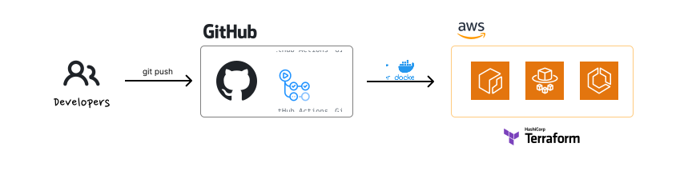

# Terraform, ECS, ECR, Github Actions

> **Disclaimer**: This project is for educational purposes only and related to a [blog post](https://dev.to/halchester/deploying-container-applications-on-aws-with-cicd-pipelines-5d53). It is not intended to be used in production. The code is not optimized and may contain bugs. Use at your own risk.

In this project, we will create a CI/CD pipeline using Github Actions to deploy a simple web application to ECS. The application is a simple vite application that will be dockerized and pushed to ECR. The pipeline will be triggered on every push to the main branch. The pipeline will build the docker image, push it to ECR, and update the ECS service with the new image. All the infrastructure will be created using Terraform.

## Prerequisites

- AWS Account
- Github Account
- Terraform
- Docker
- AWS CLI

## Architecture Overview

## Project Structure

- **.github/workflows**: Github Actions workflow files
- **app**: The web application
- **terraform**: Terraform files

## Services Used

### Web Application

We will require some sort of a web application to deploy. In this project, we will be using a simple vite application. The application will be dockerized and pushed to ECR.

### Amazon ECR

Amazon ECR service will be used to store the docker image. ECR is a managed docker registry service that allows us to store, manage, and deploy docker images. Read more about ECR [here](https://aws.amazon.com/ecr/).

### Amazon ECS

We will be using ECS to run our application. ECS is a container orchestration service that allows us to run docker containers on AWS. ECS is a managed service, which means that we don't have to worry about managing the underlying infrastructure. We will be using ECS Fargate launch type for ease of use. Read more about Fargate [here](https://aws.amazon.com/fargate/).

### Terraform

We will be using Terraform to manage our AWS infrastructure. There is also an option to create manually via the management console, but it will require a lot of manual work. Terraform will allow us to create the infrastructure as code. Read more about Terraform [here](https://www.terraform.io/).

### Github Actions

Github actions will be utilised to setup a CI/CD pipeline. It is a CI/CD service that is built into Github. It allows us to run workflows on every push to the repository. Read more about Github Actions [here](https://docs.github.com/en/actions).
